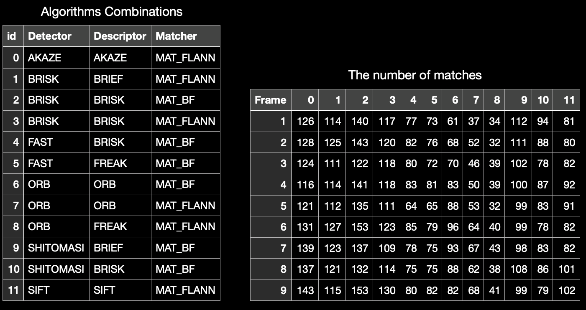

# SFND 2D Feature Tracking


## Dependencies for Running Locally

1. cmake >= 2.8
2. make >= 4.1 (Linux, Mac), 3.81 (Windows)\
3. OpenCV >= 4.1
4. gcc/g++ >= 5.4

-   Tip: Use Docker Image from [Docker Hub kimjw7981/sfnd](https://hub.docker.com/r/kimjw7981/sfnd)
    -   Run it: `docker run -p 6080:80 -v /dev/shm:/dev/shm kimjw7981/sfnd`

## Basic Build Instructions

1. Clone this repo. (or Fork)
2. Make a build directory in the top level directory: `mkdir build && cd build`
3. Compile: `cmake .. && make`
4. Run it: `./2D_feature_tracking`
5. Run below script to get data on csv and check the \*.csv files.
    ```shell
    cd ../result
    ./MP7.sh
    ./MP8.sh
    ./MP9.sh
    ```

## Result

1. Count the number of keypoints

 
 

2. Count the number of matches

 
 

3. Count the runtime of processing each frame

 
 

4. Calculate the score with weight

 

5. Top 3 combinations of detector and descriptor

 
